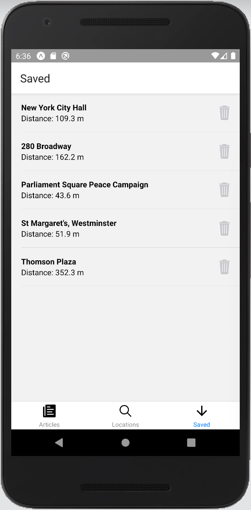

# Near Me Pedia

A simple application that shows Wikipedia articles near an address, created in [React Native](https://facebook.github.io/react-native/).

## Table of Contents

* [General info](#general-info)
* [iOS App Preview](#ios-app-preview)
* [Android App Preview](#android-app-preview)
* [Features](#features)
* [Technologies](#technologies)
* [Setup](#setup)
* [Sources](#sources)

## General info

* On the *Locations* tab users can enter an address or use the current location of the device to search Wikipedia articles near an address.
* In the *Articles* tab a list of articles is displayed near the selected address
* On the *Saved* tab the users can see their saved articles

## iOS App Preview

<p float = "left">
    
    
    
</p>

## Android App Preview

<p float = "left">
    
    
    
</p>

## Features

* Search by address
* Search by your location
* Save searched addresses
* Save searched articles
* Shows distance to articles

### TODO

* Show current distance to article
* Unmount and mount screens properly
* Loading feedback (iOS & Android)
* Optimize Bottom-Tab-Navigator Icons
* Optimize Search Errors and give better feedback

## Technologies

* **Language**: JavaScript
    * **Library**: React
    * **Framework**: React Native
* **Navigation**: React Navigation: Bottom-Tab-Navigator and Stack-Navigator
* **State Management**: Unstated
* **Persistency**: Unstated Persist
* **Location API**: Expo Location API
* **Style**: NativeBase

## Setup

Assuming that you have Node 10 LTS or greater installed and cloned the repository.

```
$ cd NearMePedia/
$ npm install
$ npm start
```

## Sources

* [React](https://reactjs.org/)
* [React Native](https://facebook.github.io/react-native/)
* [React Navigation](https://reactnavigation.org/)
* [Unstated](https://github.com/jamiebuilds/unstated)
* [Unstated Persist](https://github.com/rt2zz/unstated-persist)
* [Expo Location API](https://docs.expo.io/versions/v36.0.0/sdk/location/)
* [NativeBase](https://nativebase.io/)
